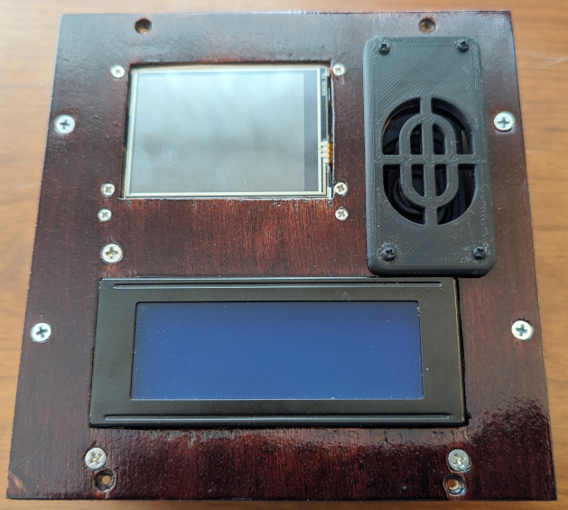
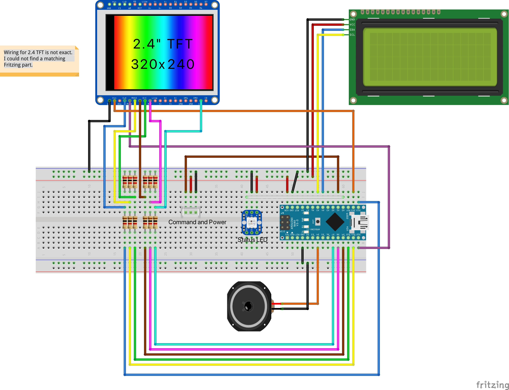
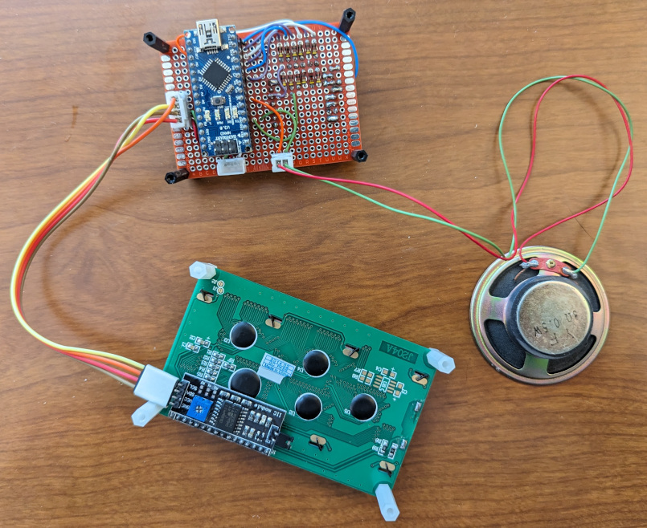
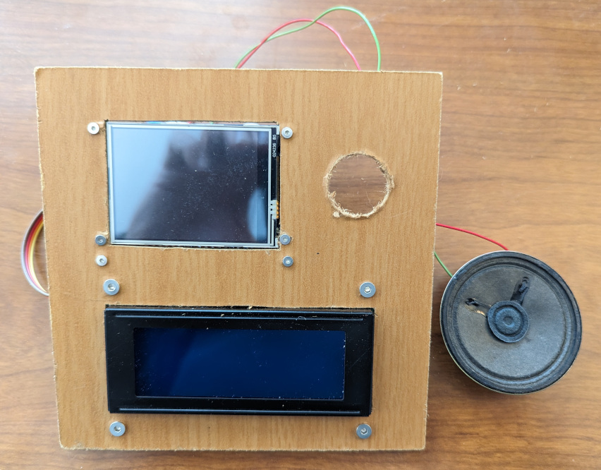
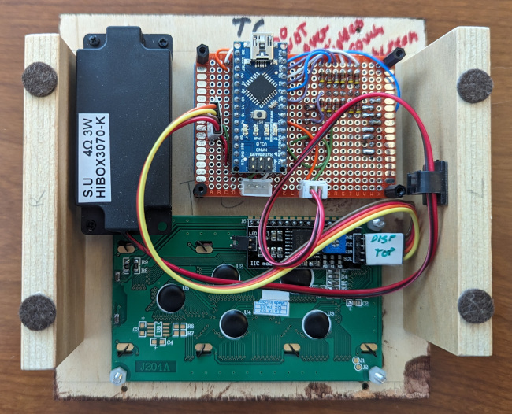

# Controller

This module manages the game play between all the puzzles and is the primary input for controlling the puzzles.

## Overview

The song that is played, when the game is won, is inspired by the early days of computing where many people wrote code to have their homemade computers play [The Entertainer](https://en.wikipedia.org/wiki/The_Entertainer_(rag)). When I first learned to program microcomputers on a [6502 based Datac 1000](https://oldcomputermuseum.com/datac-1000.html), the course taught you to write a program to play The Entertainer. My dad actually wrote the code to play songs on an Arduino and my son converted the music to the notes instructions.

The controller uses a LOLIN 2.4 Touch Screen display and a 20x4 character LCD Display. There is also a speaker to play the winning tune.

## Hardware

The controller uses an [Arduino Nano](https://store-usa.arduino.cc/products/arduino-nano) as the processor, 2 displays, one with a touch screen, and one speaker.

The Arduino Nano manages the state of the puzzle which is reflected in the [8mm NeoPixel](https://www.adafruit.com/product/1734) LED from Adafruit. See the [PhoneHome_PuzzleState.h](../PhoneHomeLib/PhoneHome_PuzzleState.h) for states and colors. The [PhoneHome_Definitions.h](../PhoneHomeLib/PhoneHome_Definitions.h) file contains the standard pins used by all Arduino Nanos.

The [Liquid Crystal Display](https://www.digikey.com/en/products/detail/sunfounder/4411-CN0296D-ND/18668625) shows instructions and is connected using the standard I2C pins. The Arduino SDA(pin A4/D18) and SCL(pin A5/D19) are connected to the LCD I2C Hat.

The [LOLIN TFT-2.4 Touch Screen](https://www.aliexpress.us/item/2251832733414978.html) is used for input and game status. It uses the ILI9341 for the display and XPT2026 for the capacitive touch. The Touch Screen is attached using SPI following the pins described in the [datasheet](https://www.wemos.cc/en/latest/d1_mini_shield/tft_2_4.html).
The LOLIN TFT runs on 3.3v while the Arduino Nano is running on 5v. The TFT is powered using the 3.3v supplied by the Arduino Nano. The data lines from the Arduino to the TFT go through a voltage divide to step the voltage from 5v to 3.3v. A pair of 1K ohm and 2K ohm resistors divide the voltage by 2/3rds. The MISO/CIPO signal to the Arduino from the TFT is left at 3.3v since the Arduino can accept 3.3v as input.

The following pin mappings are used:

| Description | Touch Screen Pin | Arduino Pin |
| :---: | :---: | :---: |
| MOSI/COPI | D7 | D11 |
| MISO/CIPO | D6 | D12 |
| SCK | D5 | D13 |
| TFT_DC | D8 | D10 |
| TFT_CS | D0 | D9 |
| TS_CS | D3 | D7 |
| RST | RST | D8 |

An [Adafruit 4 ohm speaker](https://www.adafruit.com/product/3351) is attached to pin 4 of the Arduino and ground.

The following is a Fritzing diagram of the connections.

The Controller is soldered on one 5cmx7cm 2.54mm double sided prototype PCB circuit board. The Arduino Nano is placed on the board using headers. The connection to the bus is made at the top of the Arduino Nano using a 3-pin JST connector. The neopixel state indicator LED is connected using a 3-pin JST connector as well.

The female headers on the LOLIN TFT are connected to the prototype PCB with male headers.

The I2C connection to the 20x4 char LCD is done through a row of 4 headers and a 4 wire jumper cable.

The speaker is attached using a 2-pin JST.

Soldered Controller 

## Software

The Arduino Nano manages the [State](../PhoneHomeLib/README.md#state-diagram) of the puzzle and communicates following the [Flow between Control Module and Slide into Home module](../PhoneHomeLib/README.md#sequence-diagram).

In addition to the libaries in [PhoneHomeLib](../PhoneHomeLib), the Dialer puzzle makes use of the [LiquidCrystal_I2C](https://www.arduino.cc/reference/en/libraries/liquidcrystal/) library included in the Arduino IDE. The Controller also uses the [Adafruit ILI9341](ihttps://github.com/adafruit/Adafruit_ILI9341) library from Adafruit for displaying information on the screen and the [XPT2046 Touchscreen](https://github.com/PaulStoffregen/XPT2046_Touchscreen) library from Paul Stoffregen to receive touch input from the player.

When the briefcase is first powered on, the Controller waits a couple of seconds and then starts to "Wake Up" the puzzles. Progress is displayed on the Touch Screen. When a puzzle Acknowleges the Wake up request, the box is turned green and displays the short name returned. If a puzzle does not Acknowledge the Controller due to a time-out, the box is turned red on the display.

The difficulty choices are then displayed for the player to select. If the Player selects Easy, only one phone number is used and the puzzles are played in order. If the Player selects Medium, the phone number is selected from a few numbers and the puzzles are played in random order. If the Player selects Hard, the phone number is selected from all possible phone numbers, the number is then randomized, and the puzzles are played in random order.

Once the difficulty has been selected a clock is displayed and the first puzzle is Started.
When the puzzle is completed the game will pause with instructions on how to decode the number. When the Player presses Next on the Touch Screen the next puzzle will be Started. If a puzzle does not require a pause, it will inform the Controller that none is required.

The Controller sends a Start command along with the number(s) the puzzle should use to solve. If the puzzle requires initialization, it informs the Controller which then displays the initialization instructions send by the puzzle on the 20x4 char LCD. When the puzzle is playing, it may also send playing instructions to the Controller to be displayed on the 20x4 char LCD. When the puzzle has been solved and requires instructions to decode the number, the puzzle will send the instructions for the Controller to display on the 20x4 char LCD.

When the last puzzle (Dialer Puzzle) has been solved, the Controller will play a congratulations tune.

## Assembly

A piece of scrap 1/4 inch MDF was used to test the layout and fit all the parts. Once the layout for the puzzle was complete the puzzle was test fitted into the briefcase for testing with the other puzzles and control module. The MDF prototype was used as a template for the final 1/4 inch birch plywood. The final plywood was stained and clear coated.  Sides were added so the puzzle could be pulled out of the briefcase and set on the desk when connected directly to the computer for development. In addition wiring clips were added to the sides to keep the wires tidy.

Top view of the prototype Controller showing the placement of all the components. 

Bottom view of the finished Controller showing the wire organization. 

