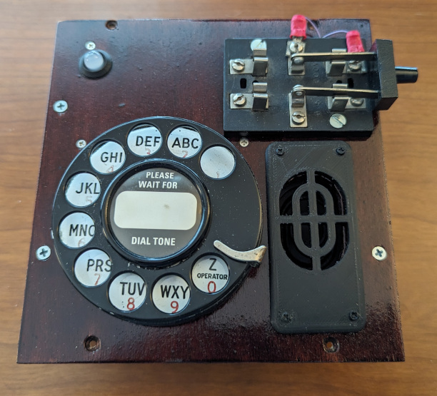
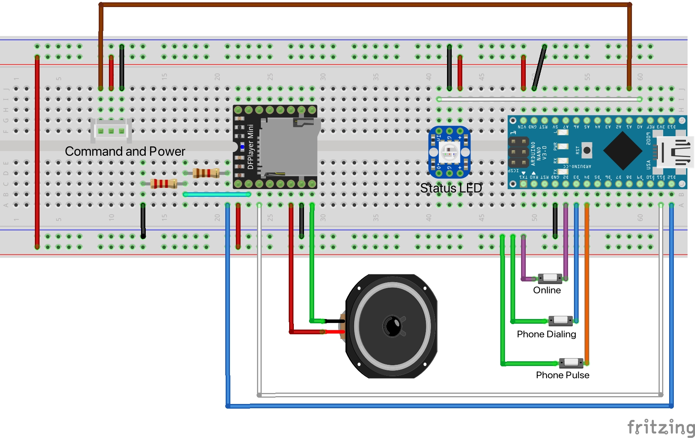
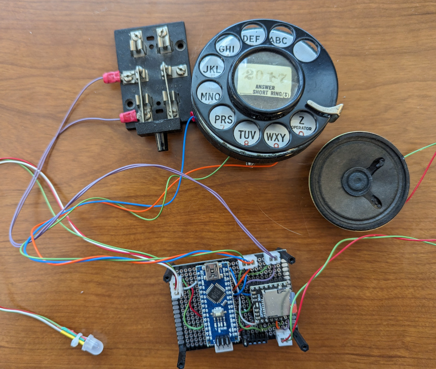
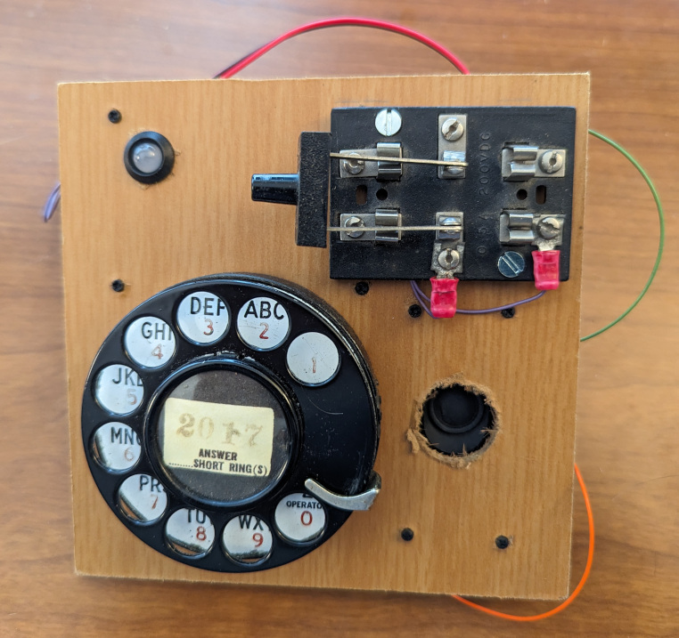
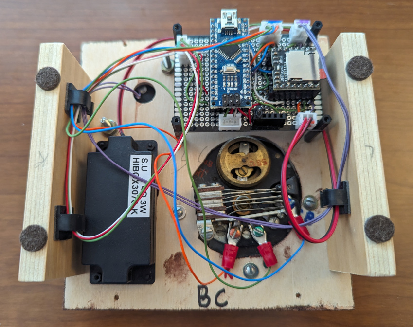

# Dialer

This puzzle reveals 7 digits. Well technically it uses 7 digits revealed by the other puzzles, but through dialing it reveals the correct order for those digits.

## Overview

This puzzle uses a rotary phone dialer, knife switch and a [DFPlayer](https://wiki.dfrobot.com/DFPlayer_Mini_SKU_DFR0299) from DF Robot.

## Hardware

The puzzle uses an [Arduino Nano](https://store-usa.arduino.cc/products/arduino-nano) as the processor and 3 digital pins are connected to switches. 1 pin is connected to the knife switch and the other 2 are connected to the phone dialer. The DFPlayer is connected to another 2 digital pins.

The Arduino Nano manages the state of the puzzle which is reflected in the [8mm NeoPixel](https://www.adafruit.com/product/1734) LED from Adafruit. See the [PhoneHome_PuzzleState.h](../PhoneHomeLib/PhoneHome_PuzzleState.h) for states and colors. The [PhoneHome_Definitions.h](../PhoneHomeLib/PhoneHome_Definitions.h) file contains the standard pins used by all Arduino Nanos.

The knife switch is connected to pin 4 on the Arduino. The Arduino initializes pin 4 enabling the internal pullup resistor. When the knife switch is closed it connects to Ground.

Only 2 switches inside the Rotary Phone Dialer are used. One indicates that dialing is in progress and is connected to pin 5 on the Arduino. The other toggles the pulses and is connected to pin 6 on the Arduino. Both pins are initialized with the internal pullup resistor enabled. When each switch closes it connects to Ground.

The DF Player is connected to pin 11 for transmitting serial messages and pin 10 for receiving serial messages. A speaker is attached to the DF Player.

The following is a Fritzing diagram of the connections.

The Dialer puzzle is soldered on one 5cmx7cm 2.54mm double sided prototype PCB circuit board. The Arduino Nano is placed on the board using headers. The connection to the bus is made at the top of the Arduino Nano using a 3 pin JST connector. The neopixel state indicator LED is connected using a 3 pin JST connector as well. A 2-pin JST connector is used to connect the knife switch. A 3-pin JST connector is used to connect the Rotary Phone Dialer.

The DF Player is also attached to the same prototype PCB circuit board as the Arduino Nano also using headers. The speaker is connected using a 2-pin JST connector.

Soldered Dialer Puzzle 

## Software

The Arduino Nano manages the [State](../PhoneHomeLib/README.md#state-diagram) of the puzzle and communicates following the [Flow between Control Module and Slide into Home module](../PhoneHomeLib/README.md#sequence-diagram).

In addition to the libaries in [PhoneHomeLib](../PhoneHomeLib), the Dialer puzzle makes use of the [Bounce2](https://github.com/thomasfredericks/Bounce2) library from Thomas Fredericks and the [DFRobotDFPlayerMini](https://github.com/DFRobot/DFRobotDFPlayerMini) library from DFRobot.

All 3 switches rely on the Arduino's internal pull-up resistor. The knife switch, attached to pin 4, is the simplist using simple open/closed logic. In order to dial, the switch must be closed (connected to ground). When the switch is closed, the dialer can be used. Opening the switch will reset the dialer state and the number will have to be redialed. This is useful if a number is mis-dialed.
The dialer uses 2 switches which are both connected to ground. The switch indicating a number is being dialed is attached to pin 5. This indicates a number is in progress of being dialed. The number pulse switch is connected to pin 6. This is used to count the number of pulses which corresponds to the number being dialed. When the dialing switch opens the number is the number of pulses counted. Thank you [Playful Technology](https://www.youtube.com/@PlayfulTechnology) for saving me from going down the complicated rabbit hole of timing the pulses.

The DFRobot library is used for the Arduino Nano to communicate with the DFPlayer Mini. Communication occurs over a SoftwareSerial configuration using pins 10 & 11. The SoftwareSerial object is passed to the DFPlayer to use when communicating with the DFPlayer Mini.
An SD Card inserted into the DFPlayer Mini contains all the Sound bites to play.

| Folder | Sound |
| :---: | :---: |
| 1 | Dialtone |
| 2 | Ringing |
| 3 | Off Hook |
| 4 | Wrong Number |

During Wake the puzzle will briefly play the dialtone.

During Initialize the puzzle checks that the knife switche is open. If the knife switch is closed, an off-hook tone is played until the switch is opened. There is no modificiation to the number or game play based on difficulty applyed to the number expected to dial.

During Play, the knife switch is expected to closed and the number dialed. When the knife switch is closed a dialtone is played until the first number is dialed. The dialed number can be restarted by lifting the knife switch and then closing it which again plays the dialtone. All 7 numbers must be dialed in the correct order.
When the target number is dialed, a ringing sound is played.
If the wrong number is dialed, a wrong number sound is played.

When the puzzle is solved the switches stop being read.

## Assembly

A piece of scrap 1/4 inch MDF was used to test the layout and fit all the parts. Once the layout for the puzzle was complete the puzzle was test fitted into the briefcase for testing with the other puzzles and control module. The MDF prototype was used as a template for the final 1/4 inch birch plywood. The final plywood was stained and clear coated.  Sides were added so the puzzle could be pulled out of the briefcase and set on the desk when connected directly to the computer for development. In addition wiring clips were added to the sides to keep the wires tidy.

Top view of the prototype Dialer Puzzle showing the placement of all the components. 

Bottom view of the finished Dialer Puzzle showing the wire organization. 

