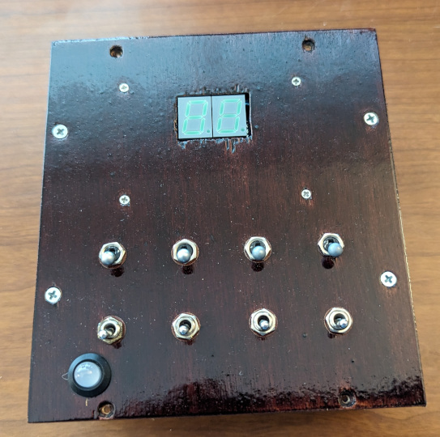
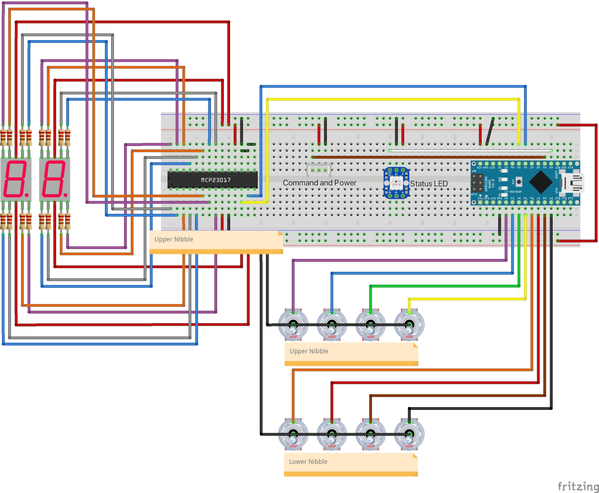
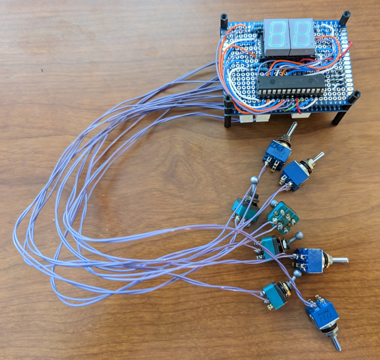
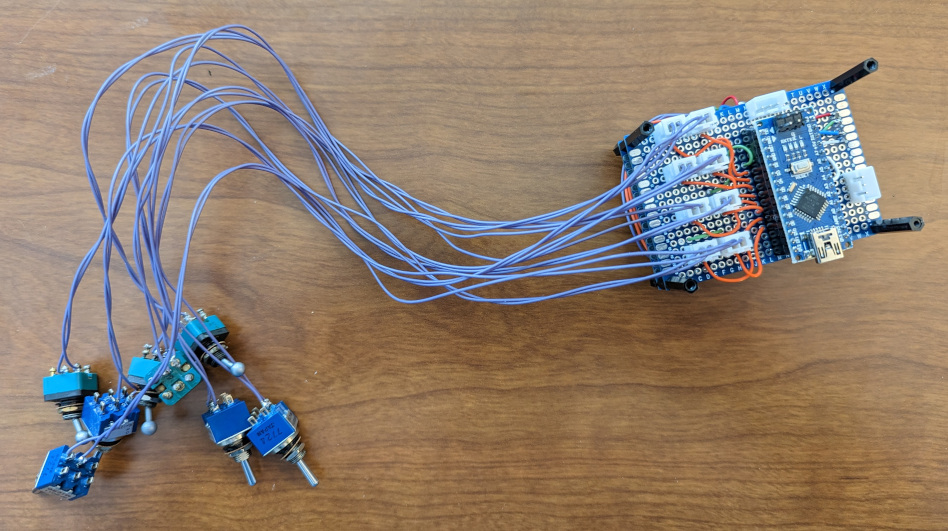
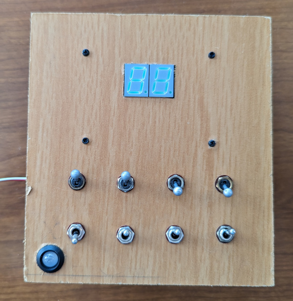
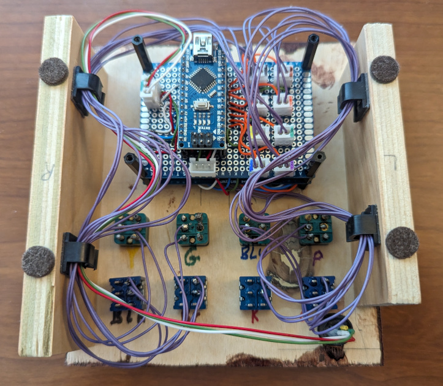

# Flip the Bits

This puzzle reveals 2 digits. While technically a byte (8 bits) can go to 3 digits, the range is limited to 255 and therefore not suitable for revealing a full 3 digit number.

## Overview

This puzzle uses 8 switches in 2 rows of 4 and 2 7-segment displays. The 8 switches represent each of 8 bits. As each switch is flipped it changes the value of a byte. The byte is displayed on the 2 7-segment displays. The display flashes "Hi" or "Lo" depending on whether the number displayed is higher or lower than the target number.
When solved, the display reveals the hex representation of the number to use. A [Hexidaisy Hexidecimal Calculator](https://www.computerhistory.org/collections/catalog/102757130) is provided to convert the hex to decimal using the hex to decimal conversion pairing along the edge.




## Hardware

The puzzle uses an Arduino Nano as the processor and 8 digital pins are connected to switches. A MCP23O17 drives the 2 7-segment displays and is connected to the Arduino Nano via I2C.

The Arduino Nano manages the state of the puzzle which is reflected in the [8mm NeoPixel](https://www.adafruit.com/product/1734) LED from Adafruit. See the [PhoneHome_PuzzleState.h](../PhoneHomeLib/PhoneHome_PuzzleState.h) for states and colors. The [PhoneHome_Definitions.h](../PhoneHomeLib/PhoneHome_Definitions.h) file contains the standard pins used by all Arduino Nanos. The Arduino Nano takes the input from the Sliders and moves the needle on the voltmeter to display the value.

The 8 switches are wired to pins 2 through 9. Pins 2 through 5 are connected to the top row from left to right and pins 6 through 9 are connected to the bottom row from left to right. The connections are color coded and ensure they are installed in the correct order. Each of the 8 switches is connected to a 2 pin JST connector. There 2 different type of switches as well to help distinguish the difference between the rows.

The [MCP23O17](https://www.adafruit.com/product/732) is a 16 bit I/O Expander connected to the Arduino Nano using I2C. Each bank of 8 bits controls a [HDSP5601](https://www.mouser.com/ProductDetail/Broadcom-Avago/HDSP-5601?qs=pQfy5%252BKCabIyrlT3Y4pBSQ%3D%3D) Green 7 segment display. The I2C connection to the MCP23O17's SCK(12) and SDA(13) is made using the default I2C pins on the Arduino Nano. Pins A0(15), A1(16), and A2(17) on the MCP23O17 are connected to ground to use the default I2C address of 0x20. The RESET(18) pin on the MCP23O17 is connected to +5v. I had left these 4 pins floating with wildly unpredictable results. :-)

```
  -a-
 |   |
 f   b
 |   |
  -g-
 |   |
 e   c
 |   |
  -d-   p
```

When connected to the 16 bit I/O Expander the byte layout is `pgfedcba` for each port as the following table shows:

| HDSP5601<BR>Display<BR>Letter | HDSP5601<BR>Display<BR>Pin | MCP23O17<BR>Bank A (GPA)<BR>Upper Nibble | MCP23O17<BR>Bank B (GPB)<BR>Lower Nibble |
| :---: | :---: | :---: | :---: |
| a   | 7     | 21 | 1 |
| b   | 6     | 22 | 2 |
| c   | 4     | 23 | 3 |
| d   | 2     | 24 | 4 |
| e   | 1     | 25 | 5 |
| f   | 9     | 26 | 6 |
| g   | 10    | 27 | 7 |
| p   | 5     | 28 | 8 |
| +5v | 3 & 8 |    |   |

+5v is supplied to the anode pins 3 and 8 on the 7-segment display. The MCP23O17 pins will light the segment LED when set to LOW or ground and will turn off the segment LED when set to HIGH. In other words, the pin values for the I/O pins is inverted from turning on/off the segment's LED. A 220 ohm resister is place between the MCP23O17 and each of the HDSP5601 segment LED Cathode pin.

The following is a Fritzing diagram of the connections.



Connecting all of switches to a breadboard and hooking up the 7-segment displays with jumper wire became a big mess, so I went right to soldering the board. I do not have a photo of the attempt to breadboard.

The Flip the Bits puzzle is soldered on 2 5cmx7cm 2.54mm double sided prototype PCB circuit board sandwiched together using headers to pass data. The Arduino Nano is placed on one of the boards using headers. The connection to the bus is made at the top of the Arduino Nano using a 3 pin JST connector. The neopixel state indicator LED is connected using a 3 pin JST connector as well. The 8 switches are connected to this board using 2 pin JST connectors.

The MCP23O17 and 2 HDSP5601s use sockets soldered to the second prototype PCB circuit board. The headers between the boards carry the I2C SDA and SCK signals from the Arduino Nano along with +5v and Ground.

Soldered Flip the Bits from the top<br>


Soldered Flip the Bits from the bottom<br>



## Software

The Arduino Nano manages the [State](../PhoneHomeLib/README.md#state-diagram) of the puzzle and communicates following the [Flow between Control Module and Slide into Home module](../PhoneHomeLib/README.md#sequence-diagram).

In addition to the libaries in [PhoneHomeLib](../PhoneHomeLib), the Flip the Bits puzzle makes use of the [Bounce2](https://github.com/thomasfredericks/Bounce2) library from Thomas Fredericks and the [Adafruit-MCP23O17-Arduino-Library](https://github.com/adafruit/Adafruit-MCP23017-Arduino-Library) library from Adafruit.

The switches are arranged in 2 groups of 4. The Arduino Nano pins (2-9) attached to the switches have the pull-up resister enabled. When the switch is thrown, the pin is grounded causing the change. The library Bounce2 is used to handle debouncing the switch. Each of the 8 pins is attached to an array of 8 Bounce2 objects which in turn is read from High(2^7) bit to Low(2^0) bit to produce a full byte.
The Adafruit library is used for the Arduino Nano to communicate with the MCP23O17. Both A and B banks are written to at the same time. The byte generated from reading the switches is broken into upper nibble and lower nibble. The nibble is looked up in an array which contains the binary representation of the 7-segment display. The 2 binary 7-segment display bytes are combined into a 2 byte word, inverted because the MCP23O17 is providing ground, and sent to the MCP23O17 for display.

During Wake the puzzle will turn on all the LED segments in both 7-segment displays and then turn them back off.

During Initialize the puzzle checks that all the switches are flipped down or off. If the difficulty is Easy, the switches are in base 2 order with the bottom 4 switchs handling from right to left 2^0 to 2^3 and the top 4 switches handling 2^4 to 2^7. If the difficulty is Medium, the bottom 4 switches are randomized and the top 4 switches are randomized. If the difficulty is Hard, all 8 switches are randomized.

During Play, the switches are read and its corresponding byte is displayed on the screen.  If the number is lower than the target number the display will alternate "Lo" and if the number is higher than the target number the display will alternate "Hi" with the number.
When the target number is discovered, all play stops and the puzzle is considered solved.

When the puzzle is solved the switches stop being read and the display shows in hex the target number. The hex to decimal table along the Hexadaisy edge can be used to convert the number from hex to decimal.


## Assembly

A piece of scrap 1/4 inch MDF was used to test the layout and fit all the parts. Once the layout for the puzzle was complete the puzzle was test fitted into the briefcase for testing with the other puzzles and control module. The MDF prototype was used as a template for the final 1/4 inch birch plywood. The final plywood was stained and clear coated.  Sides were added so the puzzle could be pulled out of the briefcase and set on the desk when connected directly to the computer for development. In addition wiring clips were added to the sides to keep the wires tidy.

Top view of the prototype Flip the Bits showing the placement of all the components.<br>


Bottom view of the finished Flip the Bits showing the wire organization.<br>


The holes for the components are labeled in color indicating which wire or light should be attached where.
