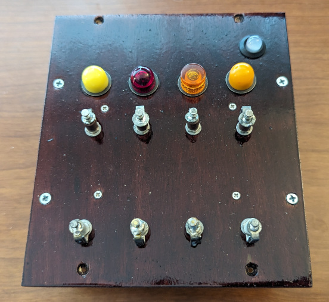
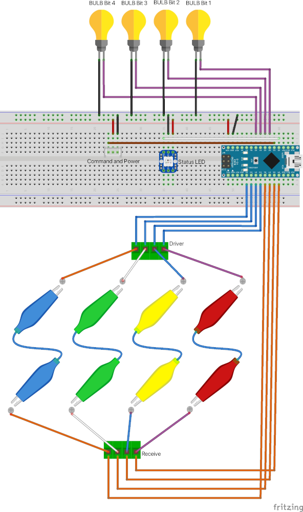
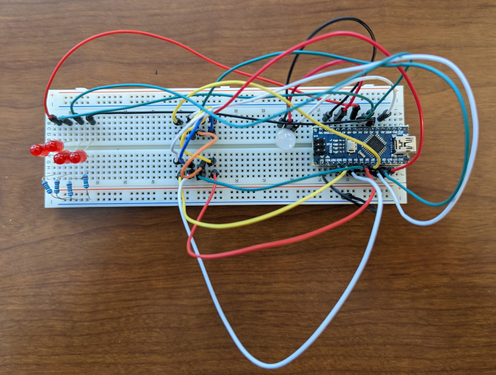
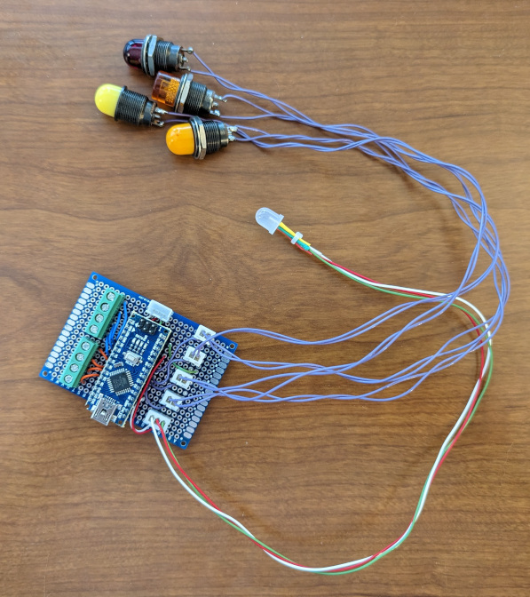
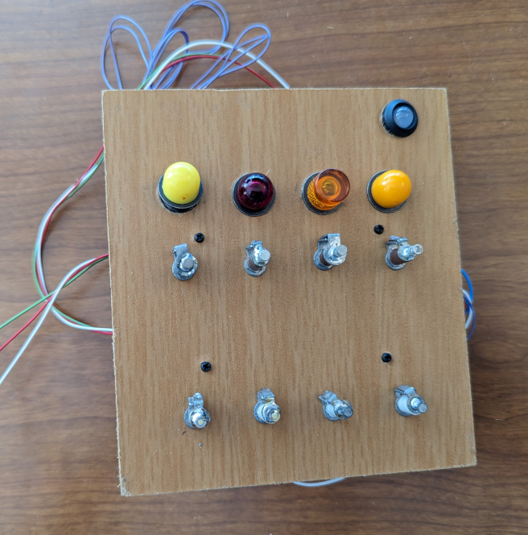
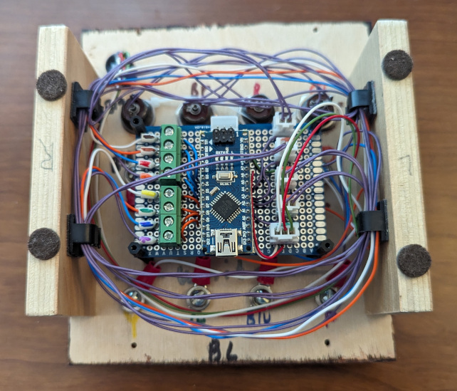

# Hook Me Up

This puzzle reveals 1 digit. While technically 4 bits can go to 2 digits, the range is limited to 16 and therefore not suitable for revealing a full 2 digit number.

## Overview

This puzzle uses 8 standoffs in 2 rows of 4 and 1 row of 4 lights. Clipleads are connected from the bottom row to the top row. If the connection is correct a light will either turn off if it was initially on or turn on if it was initially off. The puzzle is solved when each of the 4 lights remain changed from on to off or off to on. When solved, the lights reveal the binary representation of the number to use. A [Hexidaisy Hexidecimal Calculator](https://www.computerhistory.org/collections/catalog/102757130) is provided to convert the binary to decimal using the binary to hexidecimal table on the front. (the number is only between 0 and 9)

## Hardware

The puzzle uses an Arduino Nano as the processor, 4 digital pins as drivers(outputs), 4 digital pins as receivers(inputs), and 4 digital pins for the lights.

The Arduino Nano manages the state of the puzzle which is reflected in the [8mm NeoPixel](https://www.adafruit.com/product/1734) LED from Adafruit. See the [PhoneHome_PuzzleState.h](../PhoneHomeLib/PhoneHome_PuzzleState.h) for states and colors. The [PhoneHome_Definitions.h](../PhoneHomeLib/PhoneHome_Definitions.h) file contains the standard pins used by all Arduino Nanos. The Arduino Nano takes the input from the Sliders and moves the needle on the voltmeter to display the value.

The standoffs are simple insulated posts. A bracket was soldered between the post and base nut of the standoff so there is connectivity to the bottom screw. This allows the wire connecter to remain under the board. The standoffs closest to the lights are brown and the other set is white, but otherwise they are the same. The brown set are Drivers and are wired up to pins 2, 3, 4, and 5. The white set are Receivers and are wired up to pins 6, 7, 8, and 9.

The lights are wired up to A2, A3, A4, and A5.

The following is a Fritzing diagram of the connections.

The following photo shows the puzzle initially created on the breadboard. Breadboard jumper wires were used instead of clipleads and LEDs were used instead of the lights.

The Hook Me Up puzzle is soldered on to a single 5cmx7cm 2.54mm double sided prototype PCB circuit board. The Arduino Nano is placed on headers. The connection to the bus is made at the top of the Arduino Nano using a 3 pin JST connector. The neopixel state indicator LED is connected using a 3 pin JST connector as well. The wires to the standoffs are color coded and attached to screwdown terminal blocks. The lights are connected using 2 pin JST connectors.

Soldered Hook Me Up 

## Software

The Arduino Nano manages the [State](../PhoneHomeLib/README.md#state-diagram) of the puzzle and communicates following the [Flow between Control Module and Slide into Home module](../PhoneHomeLib/README.md#sequence-diagram).

The standoffs for connecting the clipleads are arranged in 2 groups of 4. One set of 4 are attached to the brown standoffs and are the Driver pins. The other set of 4 are attached to the white standoffs and are the Receiver pins. One at a time each Driver pin is set to HIGH while the remaining 3 are set to LOW. While one of the Driver pins is HIGH, the 4 Receiver pins are read to see which Driver/Receiver set is connected.

During Wake the puzzle will turn on then off all 4 of the lights.

During Initialize the puzzle checks if there is any connection between the Driver pins and the Receiver pins. Game play will proceed when there is no connection between the Driver pins and Receiver pins. 

During Play, an inverted binary number will be displayed on the lights. The Driver pins will be matched to a light. This matched set will be random for Hard difficulty. The Receiver pins will also be paired with the Driver pins. This pairing will be random for Medium and Hard difficulty.
When a connection is made between the paired Driver and Receiver pins, the matching light is turned off if on or turned on if off. Game play continues until all 4 connections have been made causing all the lights to flip state.

When the puzzle is solved the connections stop being tested and the lights show in binary the target number. The binary to hex table on the Hexadaisy can be used to convert the number from binary to decimal since the digit is always less than 10.

## Assembly

A piece of scrap 1/4 inch MDF was used to test the layout and fit all the parts. Once the layout for the puzzle was complete the puzzle was test fitted into the briefcase for testing with the other puzzles and control module. The MDF prototype was used as a template for the final 1/4 inch birch plywood. The final plywood was stained and clear coated.  Sides were added so the puzzle could be pulled out of the briefcase and set on the desk when connected directly to the computer for development. In addition wiring clips were added to the sides to keep the wires tidy.

Top view of the prototype Hook Me Up showing the placement of all the components. 

Bottom view of the finished Hook Me Up showing the wire organization. 

The holes for the components are labeled in color indicating which wire or light should be attached where.
