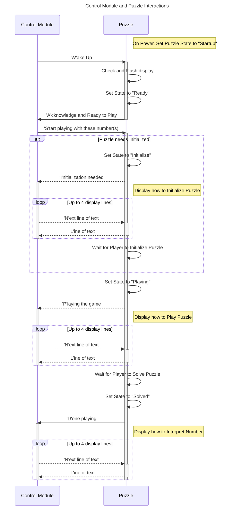
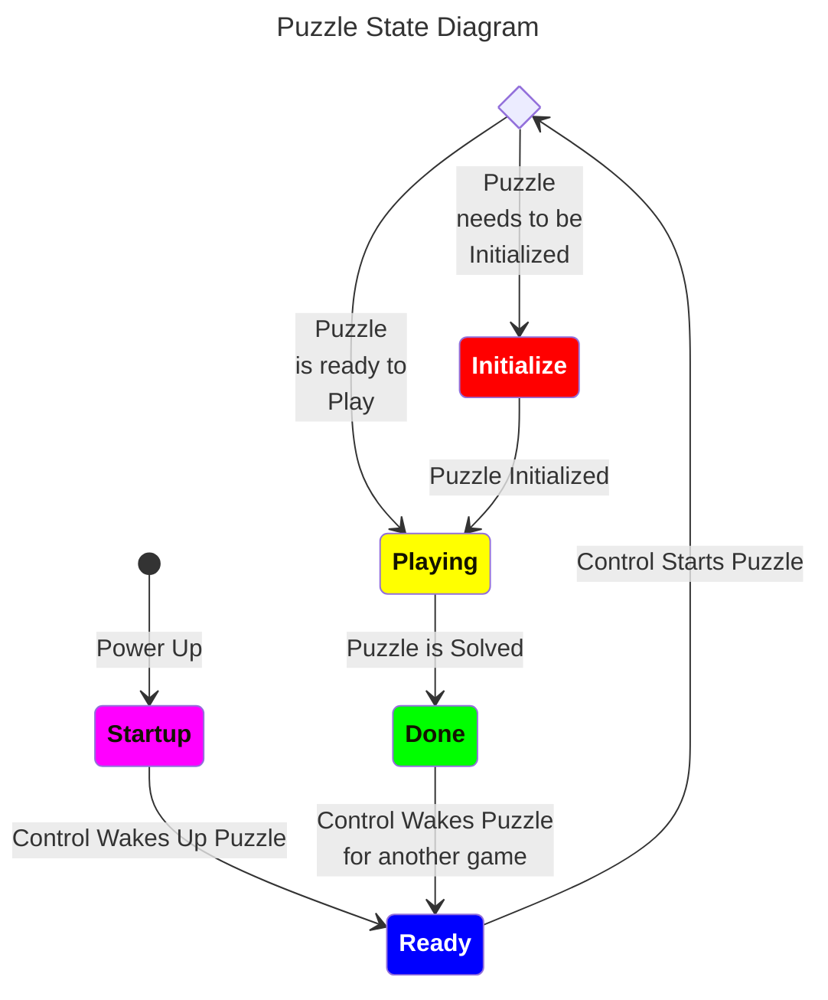

# Phone Home Library

## Overview

This Library is included by all the modules to provide standard definitions and common code.

There are 3 key include files and a test sketch.

- [**PhoneHome_Definitions.h**](PhoneHome_Definitions.h) defines the common pins to be used by all of the modules.
- [**PhoneHome_Command.h**](PhoneHome_Command.h) handles all command communication into or out of the module. Communication can happen over PJON or the USB Serial connection.
- [**PhoneHome_PuzzleState.h**](PhoneHome_PuzzleState.h) manages the puzzle states for the puzzle modules. It also handles displaying the state using colors on the neopixel.
- [**PhoneHomeLib.ino**](PhoneHomeLib.inos) is a test sketch to test if the serial handling and state management is functioning.

## Architecture

Each module uses a single Arduino Nano to handle its part of the puzzle. There are 3 pins reserved for every module. Pin *A7* is left floating and used to help with generating a seed for randomization. Pin *A0* is used by the puzzle modules to display the state of the puzzle. In the control module this pin is not used. Communication happens over Pin *A1* for all modules.

### Communication

Communication happens using the [PJON \(Padded Jitterning Operative Network\)](https://github.com/gioblu/PJON) protocol over a single wire using [SoftwareBitBang](https://github.com/gioblu/PJON/tree/master/src/strategies/SoftwareBitBang). A common library, [PhoneHome_Command.h](PhoneHome_Command.h), is used to establish a common communication language between the **Control Module** and the puzzle modules.
The *PhoneHome_Command.h* library can accept command over both the PJON wire as well as over the USB Serial connection. Responses are always sent over both PJON and USB Serial. This flexibility allows a module to be tested in isolation from the rest of the briefcase.
Here is a list of the possible commands:

| Command | Format | Description |
| ------- | ------ | ----------- |
| **W**ake | `W` | From Control to Puzzle to Wake Up |
| **A**cknowledge | `A[short name]` `[short name]`=module | From Puzzle to Control acknowledging the Wake Up |
| **S**tart | `SD###` `D`=Difficulty `###`=number | From Control to Puzzle to starting playing at the requested Difficulty using the ###s provided. |
| **I**nitialize | `I[long name]` `[long name]`=module | From Puzzle to Control to ask player to initialize the puzzle using instructions provided. |
| **P**laying | `P[long name]` `[long name]`=module | From Puzzle to share state with Control and display playing instructions. |
| **D**one | `D` or `DY` `Y`=instructions | From Puzzle to Control to indicate puzzle is solved and to optionally display decoding instructions. |
| **L**ine | `L[display line]` `[display line]`=20 char for LCD | From Puzzle to Control to share 1 line of instuction text to display on LCD. |
| **N**ext | `N` | From Control to Puzzle requesting the next line of text to display on the LCD. |
| **T**une | `T` | Request to put the puzzle in Tune state. |

One of the risks of a single wire protocol is collisions with multiple devices trying to communicate at once. This is handled by following a request-response pattern and only having one puzzle active at a time. The **Control Module** activates each puzzle when it is that puzzle's time to be played which removes communication conflicts. The state is synchronized between the puzzle and **Control Module** using the following sequence diagram and state machine:

#### Sequence Diagram

### State

Each puzzle manages their state and shares that state with the **Control Module**. The following describes each of the puzzle module states:

- **Starting** state indicates the module has performed the setup functions and is waiting for the **Control Module** to acknowledge its presence.
- **Ready** state indicates the puzzle is ready to play. This state occurs after the **Control Module** has acknowledged the module's presence and the module performed the self checks.
- **Initialize** state indicates the puzzle needs the player to reset or initialize the puzzle. When the **Control Module** request the puzzle to play, there may be a need for player interaction to reset the puzzle so play can start.
- **Playing** state indicates the player is playing the puzzle. This state is entered after the Initialization steps are complete.
- **Solved** state indicates the player has solved the puzzle. The answer remains on the display.
- **Tuning** state indicates the puzzle has been placed in tuning mode.

#### State Diagram

## Attribution

I would like to thank [Playful Technology](https://www.youtube.com/@PlayfulTechnology) on YouTube for [introducing me to PJON as a cross module communication tool](https://www.youtube.com/watch?v=u8giZveqlxs&list=PLogiUurtMYtSxku2Itst0msCv8MC2w14P&index=1). 
