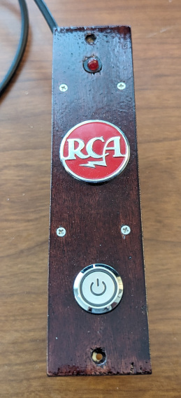
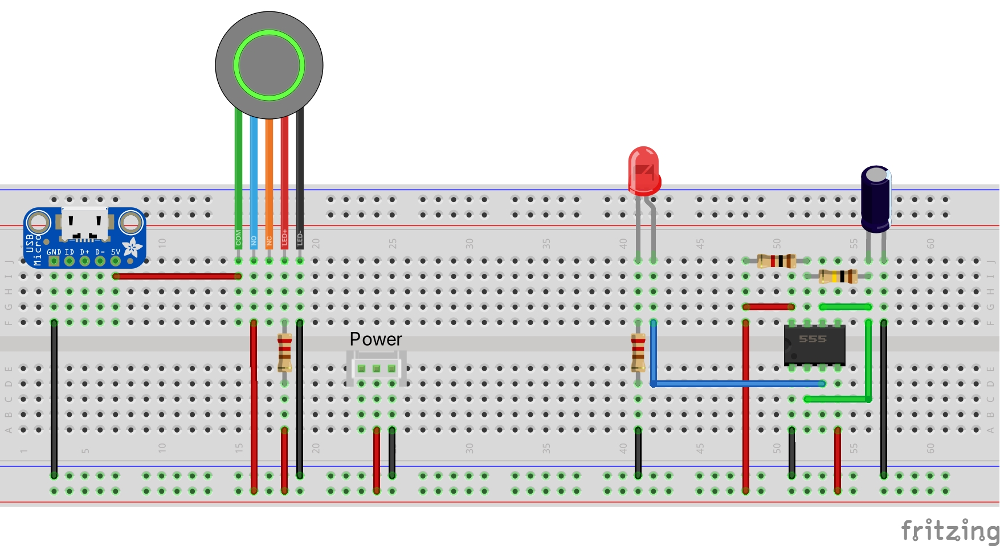
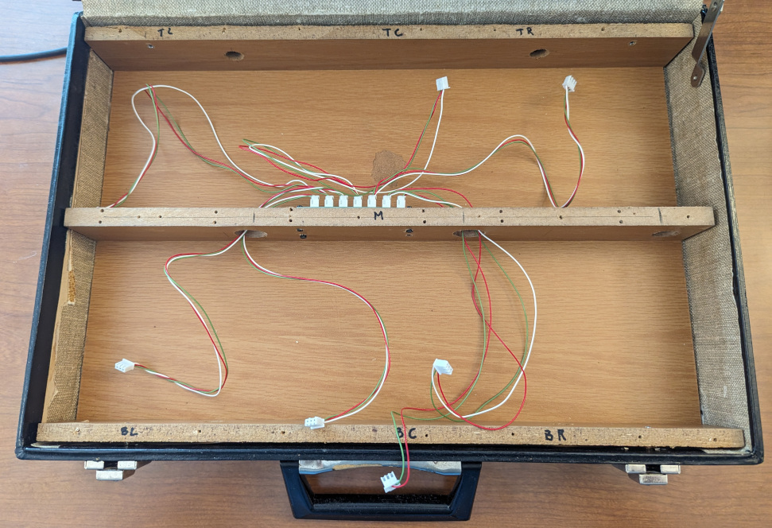
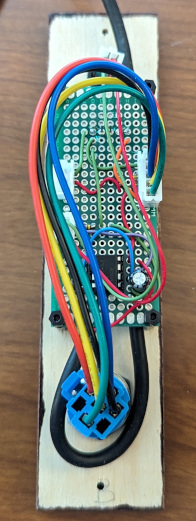

# Power Module

This module delivers power to the entire briefcase.

## Overview

The power module uses a bus to deliver +5V to all the other modules. The Blinking LED is referenced by the [Achtung!](https://en.wikipedia.org/wiki/Blinkenlights) sign my Dad brought home from work in the late 70s. My Dad worked for RCA and I found an RCA badge so I put it on the Power module. The briefcase is the same one that was used to hold the Datac 1000 and course material for the microprocessor training course by Dad took in the late 70s.

## Hardware

The power module uses a push button switch to turn the power on and off. The push button also has an LED which lights up when power is on.

There is no Arduino Nano required.

A 555 Timer IC is used to create the blinking LED. The blinking light is for the people who read the sign.

The following is a Fritzing diagram of the connections.

The 555 is soldered using a socket on one 3cmx7cm 2.54mm double sided prototype PCB circuit board. The connection to the bus is made using a 3-pin JST connector with only the +5v and Ground connected. There is no need to connect the data line.

A 5-pin JST is used to connect the push button power switch. 3 of the wires are for the switch of which only the common and NO are used. The other 2 wires are used to light the LED when the briefcase is powered on.
The LED is connected with a 2-pin JST.

## Assembly

A piece of scrap 1/4 inch MDF was used to test the layout and fit all the parts. Once the layout for the puzzle was complete the puzzle was test fitted into the briefcase for testing with the other puzzles and control module. The MDF prototype was used as a template for the final 1/4 inch birch plywood. The final plywood was stained and clear coated.

A RCA badge is added as a nod to where my Dad worked for most of his life.

A bus is created for the distribution of +5V, PJON Data, and Ground using 3-pin JST connectors. The +5V is the center pin. Ground and PJON Data are on the outside. This way if there is an accident trying to plug it in backwards,the +5V will not be sent to places it does not belong.

Empty Briefcase showing the wiring bus and wire bundles for connecting to each of the modules.

Bottom view of the finished Power Module. 

