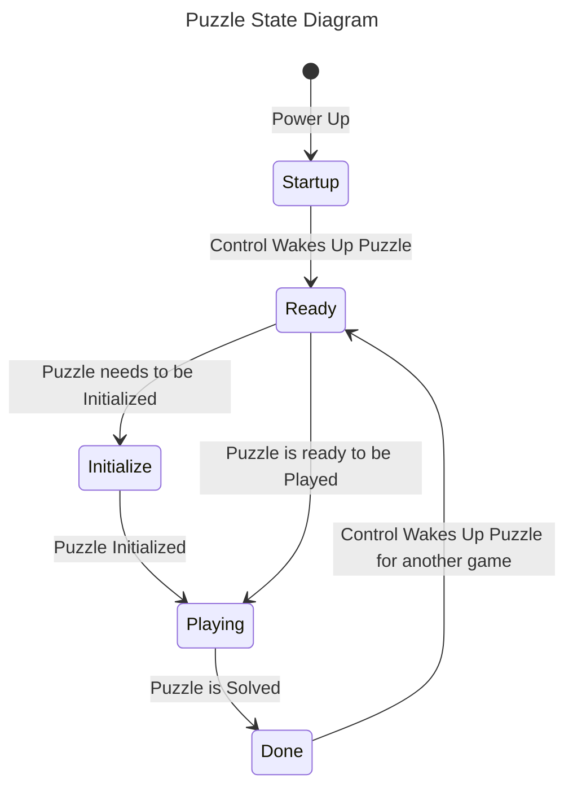

# Phone Home Busy Box


## Overview

This is a collection of repositories for a Busy Box placed into a briefcase. The purpose of the Busy Box is to determine a phone number by solving 4 puzzles. This phone number must be dialed in the 5<sup>th</sup> puzzle before time runs out.

There are 6 repositories for 6 of the modules. The 7<sup>th</sup> module is the power module and does not require any code.

- [**Control Module**](Controller) handles the flow of the game.
- [**Slide into Home**](Slider) puzzle is where sliders are moved to reveal the number on the analog meter.
- [**Hook Me Up**](ConnectWires) puzzle has the player connect wires between the top(Brown) and bottom(White) terminals to turn lights on if off or off if on revealing a binary number that must be converted to a base ten number.
- [**Flip the Bits**](FlipBits) puzzle uses switches to reveal a hexidecimal number that must be converted to a base ten number.
- [**Spin Digit**](SpinDigit) puzzle has the player make all the bars go out by spinning the number wheels to reveal the number.
- [**Dialer**](DialerPuzzle) puzzle is where the number must be dialed correctly in order to phone home.


##Layout

The Phone Home Busy Box Briefcase layout looks like this:


| Col<br>\\<br>Row | 1 | 2 | 3 |   |
| :---: | :---: | :---: | :---: | :---: |
| 1 | **Slide into Home** | **Control Module** | **Flip the Bits** | Cable |
| 2 | **Hook me Up** | **Dialer** | **Spin Digit** | Power |


##Architecture

Each module uses a single Arduino Nano to handle its part of the puzzle. Each of the 5 puzzle modules are capable of running individually with commands being sent through the USB Serial Monitor. When playing the full game, the **Control Module** sends the same commands to each of the puzzle modules in order.

Communication happens using the [PJON \(Padded Jitterning Operative Network\)](https://github.com/gioblu/PJON) protocol over a single wire using [SoftwareBitBang](https://github.com/gioblu/PJON/tree/master/src/strategies/SoftwareBitBang). A common library, [PhoneHomeLib](PhoneHomeLib), is used to establish a common communication language between the **Control Module** and the puzzle modules.
One of the risks of a single wire protocol is collisions with multiple devices trying to communicate at once. This is handled by following a request-response pattern and only having one puzzle active at a time. The **Control Module** activates each puzzle when it is that puzzle's time to be played which removes communication conflicts. The state is synchronized between the puzzle and **Control Module** using the following sequence diagram and state machine:

###Sequence Diagram
```mermaid
---
title: Control Module and Puzzle Interactions
---
sequenceDiagram
  participant control as Control Module
  participant puzzle as Puzzle
  Note right of puzzle: On Power, Set Puzzle State to "Startup"
  control->>puzzle: 'W'ake Up
  activate puzzle
  puzzle->>puzzle: Check and Flash display
  puzzle->>puzzle: Set State to "Ready"
  puzzle->>control: 'A'cknowledge and Ready to Play
  deactivate puzzle
  control->>puzzle: 'S'tart playing with these number(s)
  activate puzzle
  alt Puzzle needs Initialized
    puzzle-->>control: 'I'nstructions needed
    activate control
    loop Up to 4 display lines
      control-->>puzzle: 'N'ext line of text
      activate puzzle
      puzzle-->>control: 'L'ine of text
      deactivate puzzle:
    end
    deactivate control
  end
  puzzle-->>control: 'P'laying the game
  Note right of puzzle: Display Playing instructions
  activate control
  loop Up to 4 display lines
    control-->>puzzle: 'N'ext line of instructions
    activate puzzle
    puzzle-->>control: 'L'ine of instructions
    deactivate puzzle:
  end
  deactivate control
  puzzle->>control: 'D'one playing
  Note right of puzzle: Display number interpretation
  activate control
  loop Up to 4 display lines
    control-->>puzzle: 'N'ext line of instructions
    activate puzzle
    puzzle-->>control: 'L'ine of instructions
    deactivate puzzle:
  end
  deactivate control
  deactivate puzzle
```

###State Diagram



##Game Play

When the briefcase is powered up, the **Control Module** pings each puzzle module to confirm it is present. Each puzzle confirms it is functioning and lets the **Control Module** know it is ready to play. The **Control Module** will then ask the player to select the level of difficulty.


| Difficulty | Behavior |
| :---: | --- |
| Easy | Used to learn the game.<br>One phone number is played and the puzzles are played in order to determine the phone number to dial. |
| Medium | A phone number is selected at random and the puzzles are played in random order to determine the phone number to dial. |
| Hard | A phone number is selected at random, put in random order, and the puzzles are played in random order to determine the phone number to dial. |


