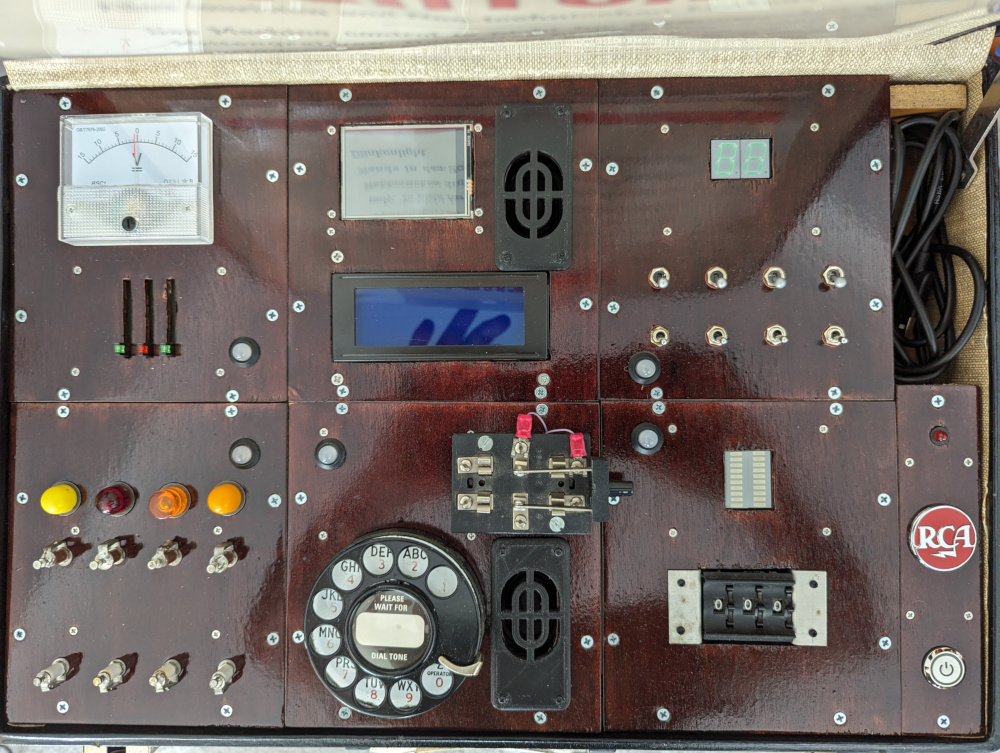

# Phone Home Busy Box

Picture of the completed Phone Home Busy Box Briefcase.

## Overview

Growing up half of my basement was an electronics lab filled with all sorts of electronic parts. My dad worked for RCA and through RCA supllied many radios to NASA, specifically the Apollo missions. When he passed, I inherited all different kinds of electronic components.

The project started, as most of my projects do, with the question:  What can I do with all these parts?  What became the Phone Home Busy Box Briefcase was inspired by a busy box my dad created for us kids. It had a group of lights and switches along with a rotary phone dialer. As you flipped switches and dialed the phone, the lights would change.

The project started as a bunch of boxes with parts.

This git repository is a collection of repositories for a Busy Box placed into a briefcase. The purpose of the Busy Box is to determine a phone number by solving 4 puzzles. This phone number must be dialed in the 5th puzzle before time runs out.

There are 6 repositories for 6 of the modules. The 7th module is the power module and does not require any code.

- [**Control Module**](Controller) handles the flow of the game.
- [**Slide into Home**](Slider) puzzle is where sliders are moved to reveal the number on the analog meter.
- [**Hook Me Up**](HookMeUp) puzzle has the player connect wires between the top(Brown) and bottom(White) terminals to turn lights on if off or off if on revealing a binary number that must be converted to a base ten number.
- [**Flip the Bits**](FlipBits) puzzle uses switches to reveal a hexidecimal number that must be converted to a base ten number.
- [**Spin Digit**](SpinDigit) puzzle has the player make all the bars go out by spinning the number wheels to reveal the number.
- [**Dialer**](DialerPuzzle) puzzle is where the number must be dialed correctly in order to phone home.

Supporting
- [**Phone Home Library**](PhoneHomeLib) is the common code and definitions used by all modules.
- [**Power Module**](Power) delivers the power to all the modules and creates the PJON data bus for all the modules to communnicate.

## Layout

The Phone Home Busy Box Briefcase layout looks like this:

| Col \\ Row | 1 | 2 | 3 |   |
| :---: | :---: | :---: | :---: | :---: |
| 1 | **Slide into Home** | **Control Module** | **Flip the Bits** | Cable |
| 2 | **Hook me Up** | **Dialer** | **Spin Digit** | Power |

## Architecture

Each module uses a single Arduino Nano to handle its part of the puzzle. Each of the 5 puzzle modules are capable of running individually with commands being sent through the USB Serial Monitor. When playing the full game, the **Control Module** sends the same commands to each of the puzzle modules in order.

Communication happens using the [PJON \(Padded Jitterning Operative Network\)](https://github.com/gioblu/PJON) protocol over a single wire using [SoftwareBitBang](https://github.com/gioblu/PJON/tree/master/src/strategies/SoftwareBitBang). A common library, [PhoneHomeLib](PhoneHomeLib), is used to establish a common communication language between the **Control Module** and the puzzle modules.
For more details on the common architecture see the [Readme](PhoneHomeLib) in the [PhoneHomeLib](PhoneHomeLib).

## Game Play

When the briefcase is powered up, the **Control Module** pings each puzzle module to confirm it is present. Each puzzle confirms it is functioning and lets the **Control Module** know it is ready to play. The **Control Module** will then ask the player to select the level of difficulty. The TFT Touchscreen will display choice and accept touch inputs. The 4 line LCD screen will display instructions. While the game is being played the Touchscreen will display a clock be displayed showing the time remaining.

| Difficulty | Phone Number | Puzzles | Behavior |
| :---: | --- | --- | --- |
| Easy | Only one | Played in Order | Used to learn the game. Puzzles reveal the phone number to dial. |
| Medium | Selected from several at Random | Played in Random Order | Puzzles reveal the phone number to dial. |
| Hard | Selected from several at Random Number is in Random Order | Played in Random Order | Puzzles reveals random numbers which must be put in the correct order for the phone number to dial. |

The **Control Module** will select a phone number based on the difficulty selected. In the case of a Hard difficulty the numbers will also be randomized. Then the **Control Module** will request playing the 4 number determining puzzles (**Slide into Home**, **Hook me Up**, **Flip the Bits**, **Spin Digit**) in sequential or random order based on the difficulty. Once the 4 puzzles are solved, the **Control Module** will request playing the **Dialer** puzzle for the player to dial the correct phone number based on the results of the solved puzzles.

Colors on the puzzle indicate the state of the puzzle:

| Status Color LED | State | Meaning |
| :---: | :---: | --- |
| Purple | Startup | The puzzle has been powered up and is waiting for a Wakeup message. |
| Blue | Ready | The puzzle is awake and waiting for its turn to start playing. |
| Red | Initialize | The puzzle needs the Player's help initialize the puzzle for playing. |
| Yellow | Playing | The Player is playing the puzzle. |
| Green | Done | The puzzle has been solved. |

When the **Control Module** requests a puzzle to start playing, it also sends the digits the puzzle is expected to use as the solution.

If the puzzle needs the Player to Initialize the puzzle (reset the puzzle) the status LED will turn Red and Initialization instructions will be dislayed on the Control Module's LCD screen. If the puzzle is already initialized or the Player has performed the Initialization tasks, the status LED will turn Yellow and playing instructions will be displayed on the Control Module's LCD screen.

During play the with Player will attempt to solve the puzzle using the instructions provided on the LCD screen. Meanwhile the clock on the Touchscreen will continue to count down. Once the puzzle has been solved, the clock will pause and instructions on how to interpret the number will be displayed on the Touchscreen. Once the Player has determined the number, they can press Next on the Touchscreen to continue to the next puzzle and the count down will continue.

When all 4 number determining puzzles(**Slide into Home**, **Hook me Up**, **Flip the Bits**, **Spin Digit**) have been solved, the **Control Module** will start play on the **Dialer** puzzle for the Player to dial the right phone number to call home.

Upon dialing the correct phone number the count down will stop, a message saying the Player has won, and a tune will play.

## Attribution

I would like to thank [Playful Technology](https://www.youtube.com/@PlayfulTechnology) on YouTube for [introducing me to PJON as a cross module communication tool](https://www.youtube.com/watch?v=u8giZveqlxs&list=PLogiUurtMYtSxku2Itst0msCv8MC2w14P&index=1). 
