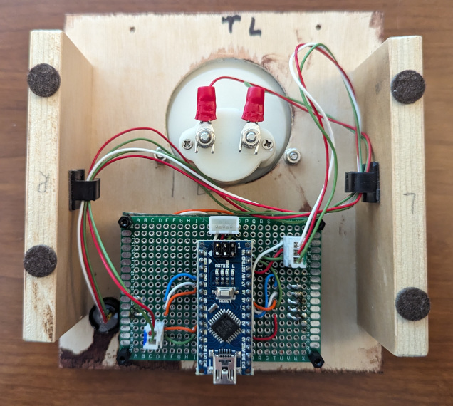

# Slide into Home

Number revealing puzzle

## Overview

This puzzle uses 3 Sliders to adjust the value on a voltmeter. The sliders will adjust where the needle is pointing on the voltmeter. Each slider is capable of changing the voltmeter between 0(bottom) and 9(top) places. Starting with the left slider, when the number is discovered the led will light up. However the puzzle is not solved until all sliders are moved from the bottom. Using the 2 leftmost sliders, the 2 leds will light up when the number is discovered. It is possible to have all 3 leds lit up, but the puzzle is not solved because the sliders must be further apart. When solved, the vaule pointed to by the needle on the voltmeter is the number to use.

## Hardware

The puzzle uses an Arduino Nano as the processor, 3 Sliders as inputs, and a Voltmeter as the display.

The Arduino Nano manages the state of the puzzle which is reflected in the [8mm NeoPixel](https://www.adafruit.com/product/1734) LED from Adafruit. (See the [Library](../PhoneHomeLib) for states and colors) The Arduino Nano takes the input from the Sliders and moves the needle on the voltmeter to display the value.

The sliders are Alpha [RA3045F-20G-15LC-B10K](https://www.mouser.com/ProductDetail/Alpha-Taiwan/RA3045F-20G-15LC-B10K-C?qs=8YYpzd7qSxKwnrbI1rOsAQ%3D%3D) (30mm travel, linear 10K, Green LED) and [RA3045F-20R-15LC-B10K](https://www.mouser.com/ProductDetail/Alpha-Taiwan/RA3045F-20R-15LC-B10K-C?qs=8YYpzd7qSxLlrphi%252BudaCA%3D%3D) (30mm travel, linear 10K, Red LED) from are wired to have 0 as the bottom and 9 at the top. They are arranged in Green, Red, Green LED order. The LEDs have a resister in series. The potentiometers are wire to pins A4, A3, and A2 using AREF to supply power. The corresponding LEDs are wired to pins 4, 3, and 2.

The display uses a [+/- 15V DC Analog Panel Meter](https://www.adafruit.com/product/4403) from Adafruit. The internal resister was removed so the Arduino Nano could drive the meter using PWM. The meter is wired to pins 9 and 10 so the voltage can be reversed to show negative numbers.

 The following photo shows the puzzle initially created on the breadboard. The sliding potentiometers were having difficulty staying put in the breadboard so I had to solder them onto a perfboard to complete my testing.

This is slider fully soldered up. The slider potentiometers are sandwiched to the Arduino circuit board. Headers are used to connect the 2 boards. JST connectors are used connect the NeoPixel and meter. Another JST is used to connect the Arduino to the briefcase bus and the Controller.

## Software

The Arduino Nano manages the [State](../PhoneHomeLib/README.md#state-diagram) of the puzzle and communicates following the [Flow between Control Module and Slide into Home module](../PhoneHomeLib/README.md#sequence-diagram).

The sliders are configured to have 0 as the bottom and 9 at the top. They are arranged in Green, Red, Green LED order. The LED(s) may light up if the number created from the left sliders revel the number. However, this does not always mean the puzzle has been solved.

## Assembly

TODO: Describe the assembly.

