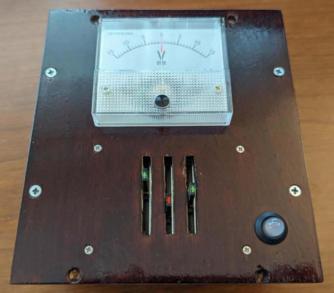
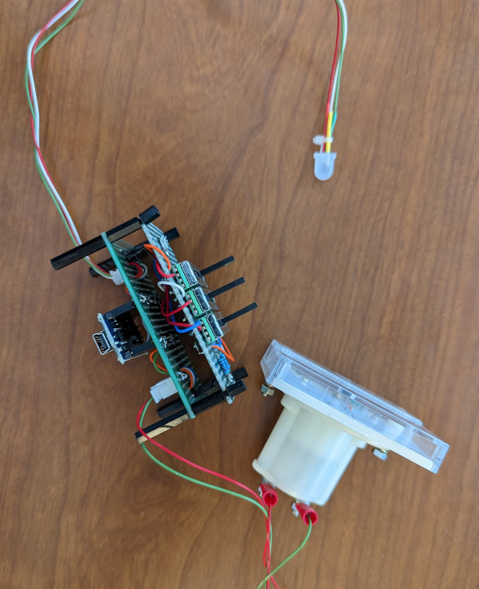
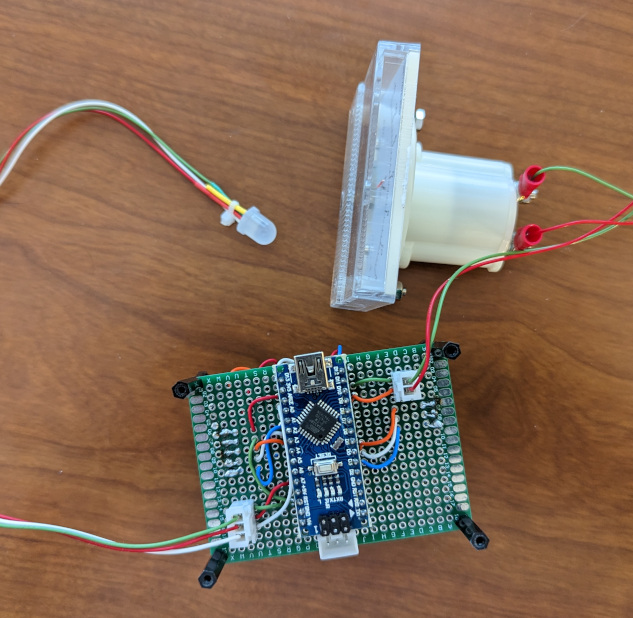

# Slide into Home

Number revealing puzzle

## Overview

This puzzle uses 3 Sliders to adjust the value on a voltmeter. The sliders will adjust where the needle is pointing on the voltmeter. Each slider is capable of changing the voltmeter between 0(bottom) and 9(top) places. Starting with the left slider, when the number is discovered the led will light up. However the puzzle is not solved until all sliders are moved from the bottom. Using the 2 leftmost sliders, the 2 leds will light up when the number is discovered. It is possible to have all 3 leds lit up, but the puzzle is not solved because the sliders must be further apart. When solved, the vaule pointed to by the needle on the voltmeter is the number to use.

## Hardware

The puzzle uses an Arduino Nano as the processor, 3 Sliders as inputs, and a Voltmeter as the display.

The Arduino Nano manages the state of the puzzle which is reflected in the [8mm NeoPixel](https://www.adafruit.com/product/1734) LED from Adafruit. See the [PhoneHome_PuzzleState.h](../PhoneHomeLib/PhoneHome_PuzzleState.h) for states and colors. The [PhoneHome_Definitions.h](../PhoneHomeLib/PhoneHome_Definitions.h) file contains the standard pins used by all Arduino Nanos. The Arduino Nano takes the input from the Sliders and moves the needle on the voltmeter to display the value.

The sliders are Alpha [RA3045F-20G-15LC-B10K](https://www.mouser.com/ProductDetail/Alpha-Taiwan/RA3045F-20G-15LC-B10K-C?qs=8YYpzd7qSxKwnrbI1rOsAQ%3D%3D) (30mm travel, linear 10K, Green LED) and [RA3045F-20R-15LC-B10K](https://www.mouser.com/ProductDetail/Alpha-Taiwan/RA3045F-20R-15LC-B10K-C?qs=8YYpzd7qSxLlrphi%252BudaCA%3D%3D) (30mm travel, linear 10K, Red LED) from are wired to have 0 as the bottom and 9 at the top. They are arranged in Green, Red, Green LED order. The LEDs have a resister in series. The potentiometers are wire to pins A4, A3, and A2 using AREF to supply power. The corresponding LEDs are wired to pins 4, 3, and 2.

The display uses a [+/- 15V DC Analog Panel Meter](https://www.adafruit.com/product/4403) from Adafruit. The internal resister was removed so the Arduino Nano could drive the meter using PWM. The meter is wired to pins 9 and 10 so the voltage can be reversed to show negative numbers. Pin 9 is connected to the Plus terminal on the voltmeter and pin 10 is connected to the Negative terminal.

The following is a Fritzing diagram of the connections.

 The following photo shows the puzzle initially created on the breadboard. The sliding potentiometers were having difficulty staying put in the breadboard so I had to solder them onto a perfboard to complete my testing.

This is slider fully soldered up. The slider potentiometers are sandwiched to the Arduino circuit board. Headers are used to connect the 2 boards. JST connectors are used connect the NeoPixel and meter. Another JST is used to connect the Arduino to the briefcase bus and the Controller.

Top view of Soldered Slider

Side view of Soldered Slider

Bottom view of Soldered Slider

## Software

The Arduino Nano manages the [State](../PhoneHomeLib/README.md#state-diagram) of the puzzle and communicates following the [Flow between Control Module and Slide into Home module](../PhoneHomeLib/README.md#sequence-diagram).

The sliders are configured to have 0 as the bottom and 9 at the top. They are arranged in Green, Red, Green LED order. On each Loop the values of the sliders are read and a resulting number is generated. This resulting number is then displayed on the voltmeter as either a positive or negative number limited to +/- 15.

During Wake the puzzle pings the voltmeter from -15 to +15. The positive is created by setting Negative Pin 10 to LOW and Plus Pin 9 to HIGH. The negative number is created by setting the Plus Pin 9 to LOW and the Negative Pin 10 to HIGH. The LEDs on the Sliders are also flashed.

During Initialize the puzzle will show the values of the sliders to help the player get to zero. Initialization functions similar to Play, but the target number is 0.

During Play, the slider values are read on each loop. A number is calculated and then displayed on the voltmeter. A PWM value is looked up in a array of values using the calculated number as the index. If the calculated number is positive, the Negative Pin 10 is set to LOW and the Plus Pin 9 is set to the PWM value using analogWrite. If the calculated number is negative, the Plus Pin 9 is set to LOW and the Negative Pin 10 is set to the PWM value using analogWrite.
Another feature of the puzzle is the use of the LEDs on the sliders. If the leftmost slider finds the target number, it's LED will light up. However, the puzzle is not solved until all the sliders are moved from 0 or the bottom. Using the 2 left sliders, both their LEDs will light up if combined they find the target number. All 3 LEDs light up when all 3 sliders are moved to find the target number.

When the puzzle is solved the sliders stop being read and the voltmeter is left on the target number.

## Assembly

A piece of scrap 1/4 inch MDF was used to test the layout and fit all the parts. Once the layout for the puzzle was complete the puzzle was test fitted into the briefcase for testing with the other puzzles and control module. The MDF prototype was used as a template for the final 1/4 inch birch plywood. The final plywood was stained and clear coated.  Sides were added so the puzzle could be pulled out of the briefcase and set on the desk when connected directly to the computer for development. In addition wiring clips were added to the sides to keep the wires tidy.

Top view of the prototype Slider showing the placement of all the components.

Bottom view of the finished Slider showing the wire organization.

