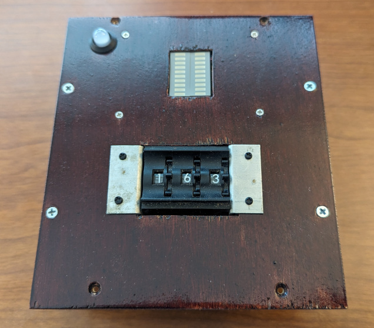
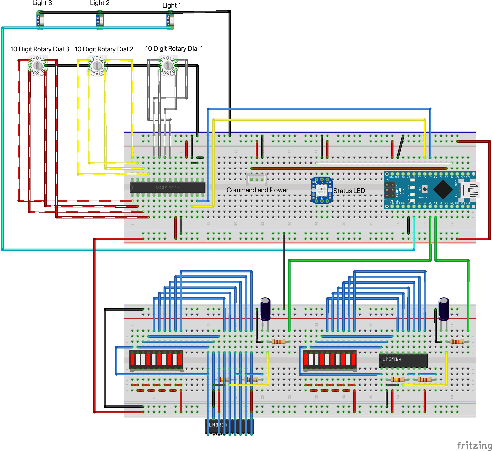
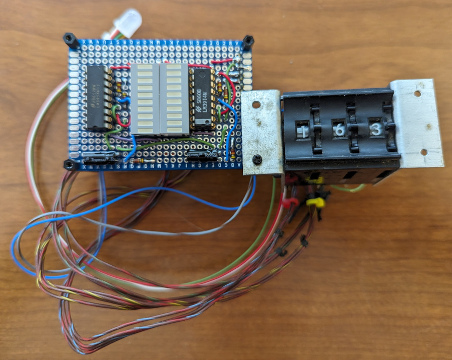
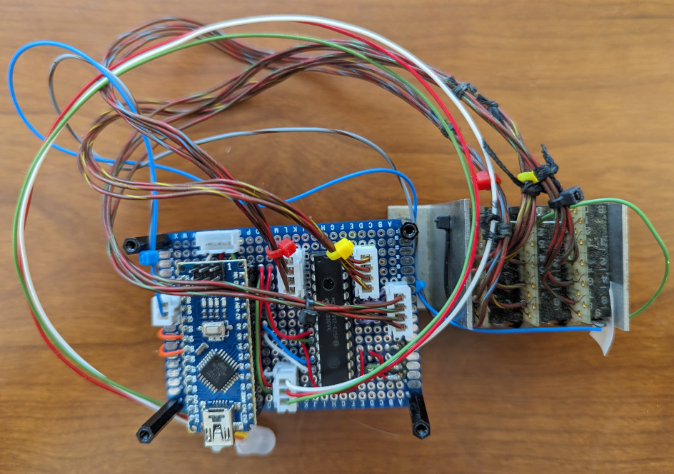
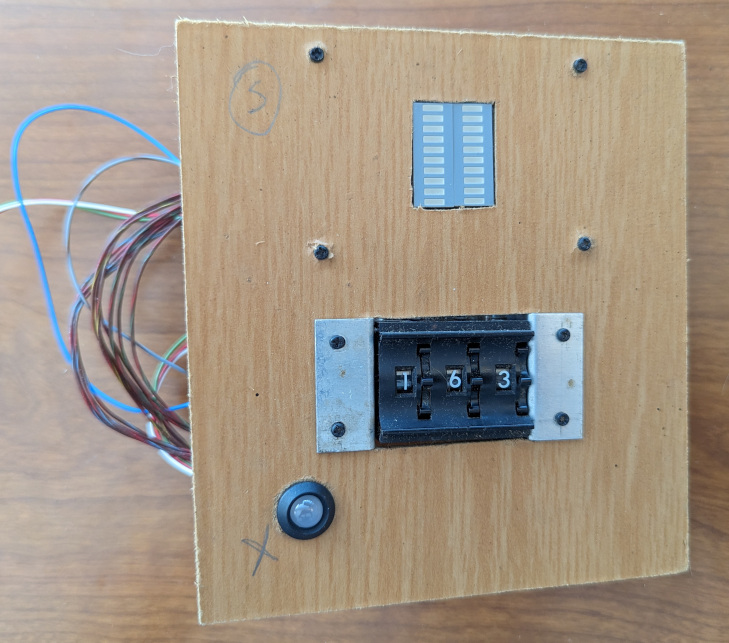
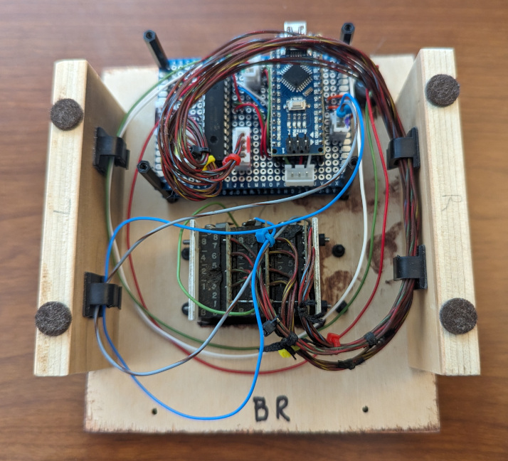

# Spin Digit

This puzzle reveals 3 digits. 

## Overview

This puzzle uses 3 rotary switches and 2 10-segment LED Bar Graph displays. The 3 rotary switches represent each of the 3 digits. As each rotary switch is turned it changes the number of LEDs lit on the 2 10-segment LED Bar Graph display. The goal is to make all the bars disappear as in nothing is lit up on the 2 10 bar LED didplays.
When solved, the number on the 3 rotary switched is the number to use.

## Hardware

The puzzle uses an Arduino Nano as the processor and 2 digital pins drive each of the LED Bar Graph displays through PWM. A MCP23O17 reads the binary value from the 3 rotary switches and is connected to the Arduino Nano via I2C.

The Arduino Nano manages the state of the puzzle which is reflected in the [8mm NeoPixel](https://www.adafruit.com/product/1734) LED from Adafruit. See the [PhoneHome_PuzzleState.h](../PhoneHomeLib/PhoneHome_PuzzleState.h) for states and colors. The [PhoneHome_Definitions.h](../PhoneHomeLib/PhoneHome_Definitions.h) file contains the standard pins used by all Arduino Nanos.

I cannot find the datasheet for the exact model of the Digitran 7-R-108 B rotary switches I used, but it is similar to one of these [Digital Display Data Sheets](https://www.digitran-switches.com/resources). The rotary switches used both binary and digital pins connectioned through the switch to a common source. I used the binary connections to decode the number dialed according to [Table 16 on the Truth Table]( https://www.digitran-switches.com/sites/digitran-switches/files/truthtables.pdf). The common is connected to ground so each of the 4 binary connected are expected to be pulled high.

The [MCP23O17](https://www.adafruit.com/product/732) is a 16 bit I/O Expander connected to the Arduino Nano using I2C. GPA0-GPA3 is connected to the right switch, GPA4-GPA7 is connected to the middle switch, and GPB0-GPB3 is connected to the left switch. This allows a full 16-bit read to return the complete value of the rotary switches. All 16 pins are initialized to use the builtin pull-up resistor. The I2C connection to the MCP23O17's SCK(12) and SDA(13) is made using the default I2C pins on the Arduino Nano. Pins A0(15), A1(16), and A2(17) on the MCP23O17 are connected to ground to use the default I2C address of 0x20. The RESET(18) pin on the MCP23O17 is connected to +5v. I had left these 4 pins floating with wildly unpredictable results. :-)

The [LM3914 Bar Display Driver](https://www.ti.com/lit/ds/symlink/lm3914.pdf?ts=1722091750682&ref_url=https%253A%252F%252Fwww.ti.com%252Fproduct%252FLM3914) is used to drive a [10-Segment LED Bar Graph Display](https://www.amazon.com/dp/B07BJ8ZGP7). Pins 1 , 18, 17, 16 & 15(aka LED No 1-5) of the LM3914 are connected to the Green LEDs, pins 14, 13 & 12(aka LED No 6-8) are connected to the Yellow LEDs, and pins 11 & 10(aka LED No 9-10) are connected the end LEDs.
On the LM3914, a 1.1K ohm resistor is placed between pin 8 (Ref Adj) and Ground. A 2.4K Ohm resistor is placed between pin 8 (Ref Adj) and pins 6 & 7 (RHI & Ref Out) since pins 6 & 7 are connected. Pin 9 on the LM3914 sets the Mode of the display and is connected to +5V indicating Bar Graph Mode. Pin 4 (RLO) is connected to Ground.
When I connected the Arduino pin 5 & 6 to pin 5 (Signal Source) on the LM3914, the display flashed with the PWM. I had to add a Low Pass Filter using a 4.7uF Capacitor and a 12K ohm resistor so that the PWM pulses would be leveled out for the LM3914. It turns out the LM3914 is very responsive so without the Low Pass Filter the LED Bar Graph was flashing all on to all off.

The following is a Fritzing diagram of the connections.

I only wired up one of the LM3914 and LED Bar Graphs pairs on the breadboard.

The Spin Digit puzzle is soldered on 2 5cmx7cm 2.54mm double sided prototype PCB circuit board sandwiched together using headers to pass data. The Arduino Nano is placed on one of the boards using headers. The connection to the bus is made at the top of the Arduino Nano using a 3 pin JST connector. The neopixel state indicator LED is connected using a 3 pin JST connector as well. The 8 switches are connected to this board using 2 pin JST connectors.

The MCP23O17 is soldered to the same board as the Arduino using sockets. There are 3 4-pin JST connectors are attached to the IO pins on the MCP23017 as well. These are color coded to ensure the correct rotary dial is connected to the right bank of IO pins.

The LM3914s and LED Bar Graph Displays are placed on sockets soldered onto a second prototype PCB circuit boardi. Headers connect the 2 boards to pass +5v, Ground, and the 2 PWM signal lines for each display. The Low Pass Filters for each side are also soldered onto this board.

Soldered Spin Digit from the top 

Soldered Spin Digit from the bottom 

## Software

The Arduino Nano manages the [State](../PhoneHomeLib/README.md#state-diagram) of the puzzle and communicates following the [Flow between Control Module and Slide into Home module](../PhoneHomeLib/README.md#sequence-diagram).

In addition to the libaries in [PhoneHomeLib](../PhoneHomeLib), the Flip the Bits puzzle makes use of the [Bounce2](https://github.com/thomasfredericks/Bounce2) library from Thomas Fredericks and the [Adafruit-MCP23O17-Arduino-Library](https://github.com/adafruit/Adafruit-MCP23017-Arduino-Library) library from Adafruit.

The rotary switches are arranged as a row of 3. The Adafruit library is used for the Arduino Nano to communicate with the MCP23O17. Both A and B banks are read from at the same time as a full word (2 bytes) and the high nibble (4 bits) is masked away by anding with 0x0FFF. To read the value of the 3 rotary switches a combination of masking and shifting is used. To get the value of the first(right) rotary switch the input is masked(anded) with 0x00F which leaved the low 4 bits. The second(middle) rotary switch is masked (anded) with 0x0F0 and then shifted by 4 bits to place the value in the low 4 bits. The third(left) rotary switch is masked (anded) with 0xF00 and then shifted by 8 bits to place the value in the low 4 bits.

The number on the display is calculated by summing the absolute value each read digit is away from the correspondng target number. This digitsAway number is the number of LEDs that should be lit on the Bar Graphs. The right 10-segment LED Bar Graph display is for Odd numbers and is connected to pin 5. The left LED Bar Graph represents Even numbers and is connected to pin 6. The value for the Even number (left) display is determined by dividing the digitsAway number by 2. The value for the Odd number (right) display is determined by adding the modulo of digitsAway by 2 plus the Even number.

During Wake the puzzle will turn on all the LED segments in both 10-segment LED Bar Graph displays and then turn them back off. The rotary switches also have a light and those are turn on and then off as well.

During Initialize the puzzle checks that all the rotary switches are set to 0. The difficulty is handled by the controller so nothing unique is performed by the puzzle. The light for the rotary switches is turned on as well.

During Play, the rotary switches are read, the digitsAway is calculated, and its value is displayed as lit LED Bars. If the number is 20 or over all the LEDs are lit up. The light for the rotary switches is turned on as well.
When the target number is discovered, all play stops and the puzzle is considered solved. When solved, the light for the rotary switches is turned off.

When the puzzle is solved the rotary switches stop being read and the value on the switches is the target number.

## Assembly

A piece of scrap 1/4 inch MDF was used to test the layout and fit all the parts. Once the layout for the puzzle was complete the puzzle was test fitted into the briefcase for testing with the other puzzles and control module. The MDF prototype was used as a template for the final 1/4 inch birch plywood. The final plywood was stained and clear coated.  Sides were added so the puzzle could be pulled out of the briefcase and set on the desk when connected directly to the computer for development. In addition wiring clips were added to the sides to keep the wires tidy.

Top view of the prototype Spin Digit showing the placement of all the components. 

Bottom view of the finished Spin Digit showing the wire organization. 

The wire connectors for the rotary switches are labeled in color indicating which switch connector should be attached where.
